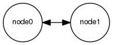

# Nanomsg Examples

> Nanomsg is a modern messaging library that is the successor to ZeroMQ, written in C by Martin Sustrik and colleagues. The nanomsg library is licensed under MIT/X11 license. "nanomsg" is a trademark of 250bpm s.r.o.
>
> -- <cite>From the README.md of the [Nanomsg.rs](http://thehydroimpulse.github.io/nanomsg.rs/nanomsg) project</cite>

- [Original Nanomsg project](http://nanomsg.org/)
- [Nanomsg.rs project](http://thehydroimpulse.github.io/nanomsg.rs/nanomsg)

This project tries to recreate the wonderful nanoms examples, writen in C from http://tim.dysinger.net/posts/2013-09-16-getting-started-with-nanomsg.html in plain Rust.

- [Getting Started with nanomsg by Tim Dysinger](http://tim.dysinger.net/posts/2013-09-16-getting-started-with-nanomsg.html)
- [dysinger's github.com repository](https://github.com/dysinger/nanomsg-examples)

# Getting Started

For a project of mine I have to work with nanomsg. Because I'm going to write the entire project in Rust I thought that it makes sense to port these instructions.

## Pipeline (A one-way pipe)

## Request/Reply (I ask, you answer)

# Pair (Two Way Radio)

# Pub/Sub (Topics & Broadcast)

# Survey (Everybody Votes)

#Bus (Routing)

