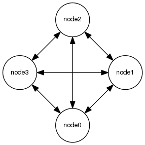

# Nanomsg-rs Examples

> Nanomsg is a modern messaging library that is the successor to ZeroMQ, written in C by Martin Sustrik and colleagues. The nanomsg library is licensed under MIT/X11 license. "nanomsg" is a trademark of 250bpm s.r.o.
>
> -- <cite>From the README.md of the [Nanomsg.rs](http://thehydroimpulse.github.io/nanomsg.rs/nanomsg) project</cite>

- [Original Nanomsg project](http://nanomsg.org/)
- [Nanomsg.rs project](http://thehydroimpulse.github.io/nanomsg.rs/nanomsg)

This project tries to recreate the wonderful nanoms examples, writen in C from http://tim.dysinger.net/posts/2013-09-16-getting-started-with-nanomsg.html in plain Rust.

- [Getting Started with nanomsg by Tim Dysinger](http://tim.dysinger.net/posts/2013-09-16-getting-started-with-nanomsg.html)
- [dysinger's github.com repository](https://github.com/dysinger/nanomsg-examples)

# Getting Started

For a project of mine I have to work with nanomsg. Because I'm going to write the entire project in Rust I thought that it makes sense to port these instructions.

## Pipeline (A one-way pipe)


```rust
extern crate nanomsg;
use nanomsg::{Socket, Protocol};
use std::io::{Read, Write};

fn node0(url: String) {
    let mut socket = Socket::new(Protocol::Pull).unwrap();
    let mut request = String::new();
    let _ = socket.bind(&url); // let _ = means we don't need any return value stored somewere

    loop {
        match socket.read_to_string(&mut request) {
            Ok(_) => println!("NODE0: RECEIVED '{}'", request),
            Err(err) => {
                println!("NODE0: failed '{}'", err);
                break
            }
        }
        request.clear();
    }
}

fn node1(url: String, msg: String) {
    let mut socket = Socket::new(Protocol::Push).unwrap();
    socket.connect(&url).unwrap();

    match socket.write_all(&msg.as_bytes()) {
        Ok(_) => println!("NODE1: SENDING '{}'", &msg),
        Err(err) => {
            println!("NODE1: failed '{}'", err);
        }
    }
}

fn usage() {
    println!("Usage: pipeline node0|node1 <URL> <ARG> ...");
}

fn main() {
    let args: Vec<_> = std::env::args().collect();

    if args.len() < 2 {
        return usage()
    }

    match args[1].as_ref() {
        "node0" => {
            if args.len() > 1 {
                node0(args[2].clone())
            }
        }
        "node1" => {
            if args.len() > 2 {
                node1(args[2].clone(), args[3].clone())
            }
        }
        _ => usage(),
    }
}
```
### Build this example
```
cargo build --example pipeline
```
### Run this example
```
cargo run --example pipeline -- node0 ipc:///tmp/pipeline.ipc & node0=$! && sleep 1
cargo run --example pipeline -- node1 ipc:///tmp/pipeline.ipc "Hello, World\!"
cargo run --example pipeline -- node1 ipc:///tmp/pipeline.ipc "Goodbye."
kill $node0
```
### Expected output
```
NODE1: SENDING 'Hello, World!'
NODE0: RECEIVED 'Hello, World!'
NODE1: SENDING 'Goodbye.'
NODE0: RECEIVED 'Goodbye.'
```

## Request/Reply (I ask, you answer)


# Pair (Two Way Radio)


# Pub/Sub (Topics & Broadcast)


# Survey (Everybody Votes)


#Bus (Routing)

